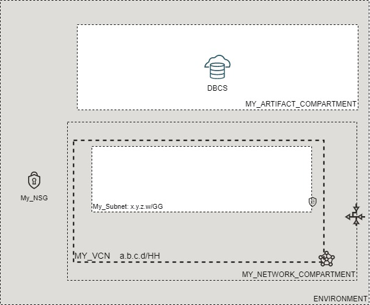

# OCI Cloud Bricks: Database Cloud Service (DBCS) Database

[](https://img.shields.io/badge/license-UPL-green) [](https://sonarcloud.io/dashboard?id=oracle-devrel_terraform-oci-cloudbricks-dbcs-database)

## Introduction
The following brick defines a DBCS DB System. This brick is decoupled from network and also decoupled from dataguard implementation. Hook it up to dataguard module if you require HA immediately implemented.

## Reference Architecture
The following is the reference architecture associated to this brick



### Prerequisites
- Pre-baked Artifact and Network Compartments
- Pre-baked Database Software Image

## Sample tfvars file
```shell
########## SAMPLE TFVAR FILE ##########
######################################## COMMON VARIABLES ######################################
region           = "foo-region-1"
tenancy_ocid     = "ocid1.tenancy.oc1..abcdefg"
user_ocid        = "ocid1.user.oc1..aaaaaaabcdefg"
fingerprint      = "fo:oo:ba:ar:ba:ar"
private_key_path = "/absolute/path/to/api/key/your_api_key.pem"
######################################## COMMON VARIABLES ######################################
######################################## ARTIFACT SPECIFIC VARIABLES ######################################
ssh_public_key                  = "/absolute/path/to/public/ssh/key/your_public_ssh_key.pub"
ssh_private_key                 = "/absolute/path/to/private/ssh/key/your_private_ssh_key"
ssh_public_is_path              = true
ssh_private_is_path             = true
fault_domains                   = ["FAULT-DOMAIN-1", "FAULT-DOMAIN-2"]
dbcs_availability_domain_number = 1
dbcs_instance_compartment_name  = "MY_ARTIFACT_COMPARTMENT"
dbcs_network_compartment_name   = "MY_NETWORK_COMPARTMENT"
network_subnet_name             = "MY_SUBNET"
vcn_display_name                = "MY_VCN"
cluster_name                    = "MY_CLUSTER_NAME"
db_admin_password               = "MY_ADMIN_PASSWORD"
db_name                         = "MY_DB_NAME"
db_display_name                 = "MY_DB_DISPLAY_NAME"
db_home_display_name            = "MY_DB_HOME_DISPLAY_NAME"
character_set                   = "AL32UTF8"
n_character_set                 = "AL16UTF16"
db_workload                     = "OLTP"
db_version                      = "19.11.0.0"
database_software_image_id      = "ocid1.databasesoftwareimage.oc1.re-region.1.aaaaaaaaoprstuv"
pdb_name                        = "MY_PLUGGABLE_DB_NAME"
db_disk_redundancy              = "HIGH"
db_system_shape                 = "VM.Standard2.2"
hostname                        = "MY_HOSTNAME"
data_storage_size_in_gb         = "2048"
license_model                   = "BRING_YOUR_OWN_LICENSE"
node_count                      = "2"
db_edition                      = "ENTERPRISE_EDITION_EXTREME_PERFORMANCE"
time_zone                       = "MY_CONTINENT/MY_CITY"
auto_backup_enabled             = true
recovery_window_in_days         = 7
auto_backup_window_utc          = "08:00AM-10:00AM_UTC"
######################################## ARTIFACT SPECIFIC VARIABLES ######################################
########## SAMPLE TFVAR FILE ##########
```

### Variable specific considerations
- Variable `database_software_image_id` must be made within OCI before provisioning a database. This matches the database version that you provide within `db_version`
- Variable `license_model` must be either `BRING_YOUR_OWN_LICENSE` or `LICENSE_INCLUDED`
- Variable `db_edition` is the Oracle Database Edition that applies to all the databases on the DB system. Exadata DB systems and 2-node RAC DB systems require ENTERPRISE_EDITION_EXTREME_PERFORMANCE.
- Variable `data_storage_size_in_gb` must be one of the following: 256, 512, 1024, 2048, 4096, 6144, 8192, 10240, 12288, 14336, 16384, 18432, 20480, 22528, 24576, 26624, 28672, 30720, 32768, 34816, 36864, 38912, 40960.


### Sample provider
The following is the base provider definition to be used with this module

```shell
terraform {
  required_version = ">= 0.13.5"
}
provider "oci" {
  region       = var.region
  tenancy_ocid = var.tenancy_ocid
  user_ocid        = var.user_ocid
  fingerprint      = var.fingerprint
  private_key_path = var.private_key_path
  disable_auto_retries = "true"
}

provider "oci" {
  alias        = "home"
  region       = data.oci_identity_region_subscriptions.home_region_subscriptions.region_subscriptions[0].region_name
  tenancy_ocid = var.tenancy_ocid  
  user_ocid        = var.user_ocid
  fingerprint      = var.fingerprint
  private_key_path = var.private_key_path
  disable_auto_retries = "true"
}
```

## Variable documentation
## Requirements

No requirements.

## Providers

| Name | Version |
|------|---------|
| <a name="provider_oci"></a> [oci](#provider\_oci) | 4.40.0 |

## Modules

No modules.

## Resources

| Name | Type |
|------|------|
| [oci_database_db_system.DBSystem](https://registry.terraform.io/providers/hashicorp/oci/latest/docs/resources/database_db_system) | resource |
| [oci_core_private_ip.DBSCANIP](https://registry.terraform.io/providers/hashicorp/oci/latest/docs/data-sources/core_private_ip) | data source |
| [oci_core_private_ip.DBVIPIP](https://registry.terraform.io/providers/hashicorp/oci/latest/docs/data-sources/core_private_ip) | data source |
| [oci_core_subnets.SUBNET](https://registry.terraform.io/providers/hashicorp/oci/latest/docs/data-sources/core_subnets) | data source |
| [oci_core_vcns.VCN](https://registry.terraform.io/providers/hashicorp/oci/latest/docs/data-sources/core_vcns) | data source |
| [oci_core_vnic.DBNODEVNIC](https://registry.terraform.io/providers/hashicorp/oci/latest/docs/data-sources/core_vnic) | data source |
| [oci_database_db_node.DBNODEDETAILS](https://registry.terraform.io/providers/hashicorp/oci/latest/docs/data-sources/database_db_node) | data source |
| [oci_database_db_nodes.DBNODELIST](https://registry.terraform.io/providers/hashicorp/oci/latest/docs/data-sources/database_db_nodes) | data source |
| [oci_identity_availability_domain.AD](https://registry.terraform.io/providers/hashicorp/oci/latest/docs/data-sources/identity_availability_domain) | data source |
| [oci_identity_compartments.COMPARTMENTS](https://registry.terraform.io/providers/hashicorp/oci/latest/docs/data-sources/identity_compartments) | data source |
| [oci_identity_compartments.NWCOMPARTMENTS](https://registry.terraform.io/providers/hashicorp/oci/latest/docs/data-sources/identity_compartments) | data source |

## Inputs

| Name | Description | Type | Default | Required |
|------|-------------|------|---------|:--------:|
| <a name="input_auto_backup_enabled"></a> [auto\_backup\_enabled](#input\_auto\_backup\_enabled) | Defines if autobackup is enabled or not | `bool` | `false` | no |
| <a name="input_auto_backup_window_utc"></a> [auto\_backup\_window\_utc](#input\_auto\_backup\_window\_utc) | Defines the recovery 2 hour window. The values must be from '12:00AM-02:00AM\_UTC' to '10:00PM-12:00AM\_UTC', if different value is provided defaults to null (ANYTIME) | `string` | `"ANYTIME"` | no |
| <a name="input_character_set"></a> [character\_set](#input\_character\_set) | Charset used by DB | `any` | n/a | yes |
| <a name="input_cluster_name"></a> [cluster\_name](#input\_cluster\_name) | Describes the DB Cluster Name | `string` | `"DB-Cluster"` | no |
| <a name="input_data_storage_size_in_gb"></a> [data\_storage\_size\_in\_gb](#input\_data\_storage\_size\_in\_gb) | Database Storage in GB | `any` | n/a | yes |
| <a name="input_database_software_image_id"></a> [database\_software\_image\_id](#input\_database\_software\_image\_id) | Defines the OCID of the Database Software Image that should be used by database | `any` | `null` | no |
| <a name="input_db_admin_password"></a> [db\_admin\_password](#input\_db\_admin\_password) | DBCS Administration Password | `any` | n/a | yes |
| <a name="input_db_disk_redundancy"></a> [db\_disk\_redundancy](#input\_db\_disk\_redundancy) | Database Disk Redundancy | `any` | n/a | yes |
| <a name="input_db_display_name"></a> [db\_display\_name](#input\_db\_display\_name) | Database Display Name | `any` | n/a | yes |
| <a name="input_db_edition"></a> [db\_edition](#input\_db\_edition) | Database Edition | `any` | n/a | yes |
| <a name="input_db_home_display_name"></a> [db\_home\_display\_name](#input\_db\_home\_display\_name) | Database Home Display Name | `any` | n/a | yes |
| <a name="input_db_name"></a> [db\_name](#input\_db\_name) | Database Name | `any` | n/a | yes |
| <a name="input_db_system_shape"></a> [db\_system\_shape](#input\_db\_system\_shape) | DB Systems Shape | `any` | n/a | yes |
| <a name="input_db_version"></a> [db\_version](#input\_db\_version) | Database Version | `any` | n/a | yes |
| <a name="input_db_workload"></a> [db\_workload](#input\_db\_workload) | Workload intended from DB | `any` | n/a | yes |
| <a name="input_dbcs_availability_domain_number"></a> [dbcs\_availability\_domain\_number](#input\_dbcs\_availability\_domain\_number) | Defines the availability domain where OCI artifact will be created. This is a numeric value greater than 0 | `any` | n/a | yes |
| <a name="input_dbcs_instance_compartment_id"></a> [dbcs\_instance\_compartment\_id](#input\_dbcs\_instance\_compartment\_id) | Defines the compartment OCID where the infrastructure will be created | `string` | `""` | no |
| <a name="input_dbcs_instance_compartment_name"></a> [dbcs\_instance\_compartment\_name](#input\_dbcs\_instance\_compartment\_name) | Defines the compartment name where the infrastructure will be created | `string` | `""` | no |
| <a name="input_dbcs_network_compartment_name"></a> [dbcs\_network\_compartment\_name](#input\_dbcs\_network\_compartment\_name) | Defines the compartment where the Network is currently located | `any` | n/a | yes |
| <a name="input_fault_domains"></a> [fault\_domains](#input\_fault\_domains) | Fault Domains | `string` | `""` | no |
| <a name="input_fingerprint"></a> [fingerprint](#input\_fingerprint) | API Key Fingerprint for user\_ocid derived from public API Key imported in OCI User config | `any` | n/a | yes |
| <a name="input_hostname"></a> [hostname](#input\_hostname) | DB Hostname | `any` | n/a | yes |
| <a name="input_license_model"></a> [license\_model](#input\_license\_model) | Database System License Model | `any` | n/a | yes |
| <a name="input_n_character_set"></a> [n\_character\_set](#input\_n\_character\_set) | N Charset used by DB | `any` | n/a | yes |
| <a name="input_network_subnet_name"></a> [network\_subnet\_name](#input\_network\_subnet\_name) | Defines the subnet display name where this resource will be created at | `any` | n/a | yes |
| <a name="input_node_count"></a> [node\_count](#input\_node\_count) | Amount of nodes in DB | `any` | n/a | yes |
| <a name="input_pdb_name"></a> [pdb\_name](#input\_pdb\_name) | Pluggable Database Name for DB | `any` | n/a | yes |
| <a name="input_private_key_path"></a> [private\_key\_path](#input\_private\_key\_path) | Private Key Absolute path location where terraform is executed | `any` | n/a | yes |
| <a name="input_recovery_window_in_days"></a> [recovery\_window\_in\_days](#input\_recovery\_window\_in\_days) | Defines the recovery window in days. Supported values are 7,15,30,45 and 60 days | `any` | `null` | no |
| <a name="input_region"></a> [region](#input\_region) | Target region where artifacts are going to be created | `any` | n/a | yes |
| <a name="input_ssh_private_is_path"></a> [ssh\_private\_is\_path](#input\_ssh\_private\_is\_path) | Describes if SSH Private Key is located on file or inside code | `bool` | `false` | no |
| <a name="input_ssh_private_key"></a> [ssh\_private\_key](#input\_ssh\_private\_key) | Private Key to use for latter connection to the DB on null resource | `any` | n/a | yes |
| <a name="input_ssh_public_is_path"></a> [ssh\_public\_is\_path](#input\_ssh\_public\_is\_path) | Describes if SSH Public Key is located on file or inside code | `bool` | `false` | no |
| <a name="input_ssh_public_key"></a> [ssh\_public\_key](#input\_ssh\_public\_key) | Defines SSH Public Key to be used in order to remotely connect to compute instance | `string` | n/a | yes |
| <a name="input_storage_management"></a> [storage\_management](#input\_storage\_management) | The storage option used in DB system. ASM - Automatic storage management LVM - Logical Volume management | `string` | `"ASM"` | no |
| <a name="input_tenancy_ocid"></a> [tenancy\_ocid](#input\_tenancy\_ocid) | OCID of tenancy | `any` | n/a | yes |
| <a name="input_time_zone"></a> [time\_zone](#input\_time\_zone) | Timezone definition for Database | `string` | `"America/Santiago"` | no |
| <a name="input_user_ocid"></a> [user\_ocid](#input\_user\_ocid) | User OCID in tenancy | `any` | n/a | yes |
| <a name="input_vcn_display_name"></a> [vcn\_display\_name](#input\_vcn\_display\_name) | VCN Display name to execute lookup | `any` | n/a | yes |

## Outputs

| Name | Description |
|------|-------------|
| <a name="output_db_nodes_info"></a> [db\_nodes\_info](#output\_db\_nodes\_info) | DB Node hostname-IP map |
| <a name="output_db_nodes_scan_ips"></a> [db\_nodes\_scan\_ips](#output\_db\_nodes\_scan\_ips) | Nodes SCAN IPs |
| <a name="output_db_nodes_vip_info"></a> [db\_nodes\_vip\_info](#output\_db\_nodes\_vip\_info) | VIP hostname-IP map |
| <a name="output_dbcs_db_system"></a> [dbcs\_db\_system](#output\_dbcs\_db\_system) | Database DB System instance |

## Contributing
This project is open source.  Please submit your contributions by forking this repository and submitting a pull request!  Oracle appreciates any contributions that are made by the open source community.

## License
Copyright (c) 2021 Oracle and/or its affiliates.

Licensed under the Universal Permissive License (UPL), Version 1.0.

See [LICENSE](LICENSE) for more details.
